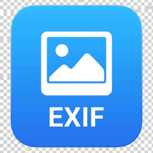

[日本語](README.md)

<h1 align="center">
     
    PhotoFrameGenerator
</h1>

    
    
    
     
    
    
    
    
    

---

## アプリケーション概要
撮影時の情報を写真の周りに埋め込むアプリケーションです｡

## ダウンロード方法
 [GitHubのReleases](https://github.com/overdrive1708/PhotoFrameGenerator/releases)にあるLatestのAssetsよりPhotoFrameGenerator_Ver.x.x.x.zipをダウンロードしてください｡

## 使い方
T.B.D.

## 開発環境
 Visual Studio 2026 Community

## 使用しているライブラリ
詳細は[NOTICE.md](NOTICE.md)を参照してください｡

## ライセンス
このプロジェクトはMITライセンスです。  
詳細は [LICENSE](LICENSE) を参照してください。

## 不具合報告と機能要望
[GitHubのIssue](https://github.com/overdrive1708/PhotoFrameGenerator/issues)より報告してください｡

## 作者
[overdrive1708](https://github.com/overdrive1708)
